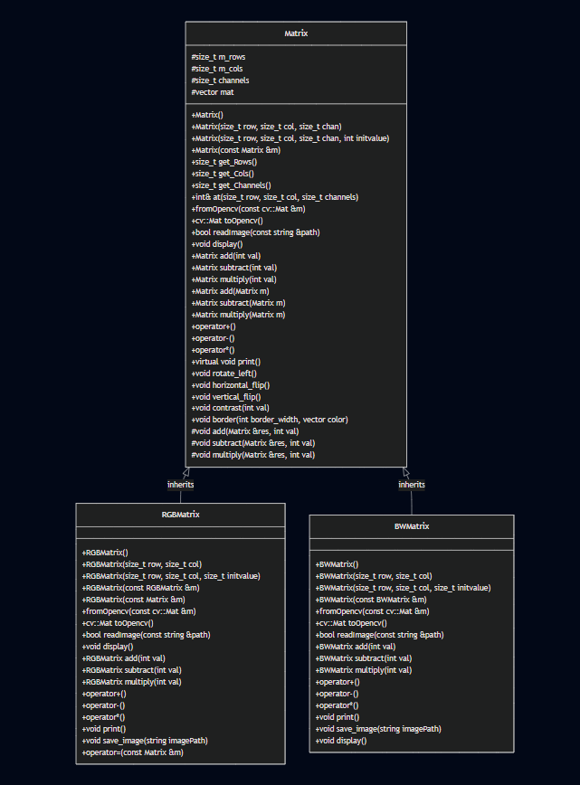
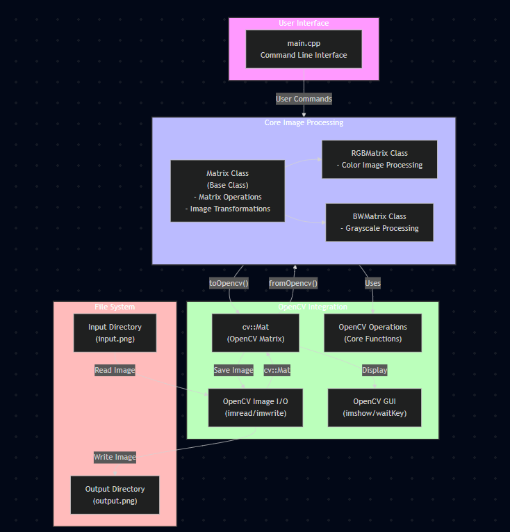

<h2 style="text-align: center">PhotoShop App</h2>

A simple Photoshop-style application built to demonstrate Object-Oriented Programming (OOP) concepts in C++.

### Introduction:
This project was developed during my engineering coursework as part of the Object-Oriented Programming with C++ subject. The main goal of this mini-project is to showcase core OOP principles in C++ through a practical, real-world example of a basic image editing application — similar to Photoshop.

It includes implementations of key OOP concepts such as:
- Classes & Objects
- Encapsulation
- Inheritance
- Polymorphism
- Abstraction
- Constructors & Destructors
- Operator Overloading
- and more...

Along with OOP concepts, this project also provides hands-on exposure to real C++ software development, including working with CMake and other build system practices.

### ✨ Features

This application provides a collection of basic image-editing functionalities, similar to a lightweight Photoshop tool. The supported features include:

1. **Rotate 90° Left**:
Instantly rotate the image 90 degrees counter-clockwise.

2. **Rotate 90° Right**
Rotate the selected image 90 degrees clockwise.

3. **Rotate 180°**
Flip the image upside down by rotating it 180 degrees.

4. **Save Edited Image**
Save the processed image to disk with the applied modifications.

5. **Horizontal Flip**
Mirror the image along the horizontal axis (left ↔ right).

6. **Vertical Flip**
Flip the image along the vertical axis (top ↔ bottom).

7. **Adjust Contrast**
Modify the contrast of the image to enhance brightness and clarity.

8. **Display Image**
View the processed image directly through the application window.

9. **Add Border**
Apply a simple border around the image to enhance its appearance.

## Project Structure

Key files and folders in this repository:

- `CMakeLists.txt` — build configuration for the project.
- `main.cpp` — program entrypoint and CLI wiring.
- `include/` — public headers (`matrix.h`, `bw_matrix.h`, `rgb_matrix.h`).
- `src/` — implementation sources (`matrix.cpp`, `bw_matrix.cpp`, `rgb_matrix.cpp`).
- `input/` and `output/` — sample input images and output directory for processed images.

## Architecture

This project follows a small layered architecture suitable for a CLI-based image processing tool.

- Presentation / CLI: `main.cpp` — parses arguments and invokes operations.
- Core domain: matrix abstractions in `matrix.*`, `bw_matrix.*`, `rgb_matrix.*` — image data and operations.
- IO: reading from `input/` and writing to `output/` via simple file helpers.

### Class Diagram:


### Component/Architecture Flow Diagram:


## Build & Run

### Prerequisites

1. **CMake** (Version 3.5.0 or higher)
   - Download from: https://cmake.org/download/
   - Choose the Windows x64 Installer
   - During installation, select the option to add CMake to the system PATH

2. **Visual Studio** (2019 or 2022 with C++ support)
   - Download from: https://visualstudio.microsoft.com/vs/community/
   - During installation, select "Desktop development with C++"
   - This will install the necessary C++ compiler and build tools

3. **OpenCV** (Required for image processing)
   - Download from: https://opencv.org/releases/
   - Extract to a location on your system (e.g., C:\opencv)
   - Add OpenCV's bin directory to your system PATH:
     - Right-click on 'This PC' → Properties → Advanced system settings → Environment Variables
     - Under System Variables, find and select 'Path'
     - Click 'Edit' and add the path to OpenCV's bin directory (e.g., C:\opencv\build\x64\vc16\bin)
   - Set the OpenCV_DIR environment variable:
     - In the same Environment Variables window
     - Under System Variables, click 'New'
     - Variable name: OpenCV_DIR
     - Variable value: path to OpenCV build directory (e.g., C:\opencv\build)

4. **VS Code** (optional, but recommended)
   - Download from: https://code.visualstudio.com/
   - Install the "C/C++" extension

### Building with CMake (All Platforms)

1. Open terminal in the project root directory
2. Run the following commands:

```powershell
# Create and enter build directory
mkdir build
cd build

# Generate build files
cmake ..

# Build the project
cmake --build . --config Release
```

### Building with Visual Studio Code

1. Open the project in VS Code
2. Install the "C/C++" extension if not already installed
3. Use the built-in task (Ctrl+Shift+B) which uses `cl.exe` to build the active file

### Building on Different Platforms

#### Windows (Visual Studio)
```powershell
# Using Developer Command Prompt for VS
mkdir build
cd build
cmake -G "Visual Studio 17 2022" ..
cmake --build . --config Release
```

#### Linux/macOS
```bash
mkdir build && cd build
cmake ..
make
```

## How to Use
### Basic Usage

1. Prepare your image:
   - Place your image as `input.png` in the `input/` directory
   - Supported formats: PNG (configured in `main.cpp` as `input\\input.png`)

2. Run the application:
   ```powershell
   # From the build directory
   ./photoshop_app
   ```

### Interactive Menu Options

The program runs in interactive mode with two main menus:

1. First Menu - Image Type Selection:
   ```
   Select Options
   1. Read COLOR Image
   2. Read Black and white image
   ```

2. Second Menu - Operations:
   ```
   Select options
   1. Rotate 90 degree left
   2. Rotate 90 degree right
   3. Rotate 180 degree
   4. Save image
   5. Horizontal flip
   6. Vertical flip
   7. Contrast
   8. Display
   9. Go back
   10. Add border
   ```

### Example Usage Flow

1. Start the program
2. Choose image type (1 for color, 2 for B&W)
3. Select operations from the menu:
   - For rotation: Choose options 1-3
   - For flipping: Choose options 5-6
   - For contrast: Choose 7, then enter value (-100 to +100)
   - For border: Choose 10, then:
     - Enter border width
     - Select color (1=Red, 2=Green, 3=Blue)
4. View results with option 8 (Display)
5. Save with option 4 (saves to `output\output.png`)
6. Use option 9 to go back to image type selection

### Notes
- The output is always saved as `output\output.png`
- Make sure OpenCV is properly installed (program uses `opencv2` library)
- The display window will show your changes in real-time
- You can chain multiple operations before saving

